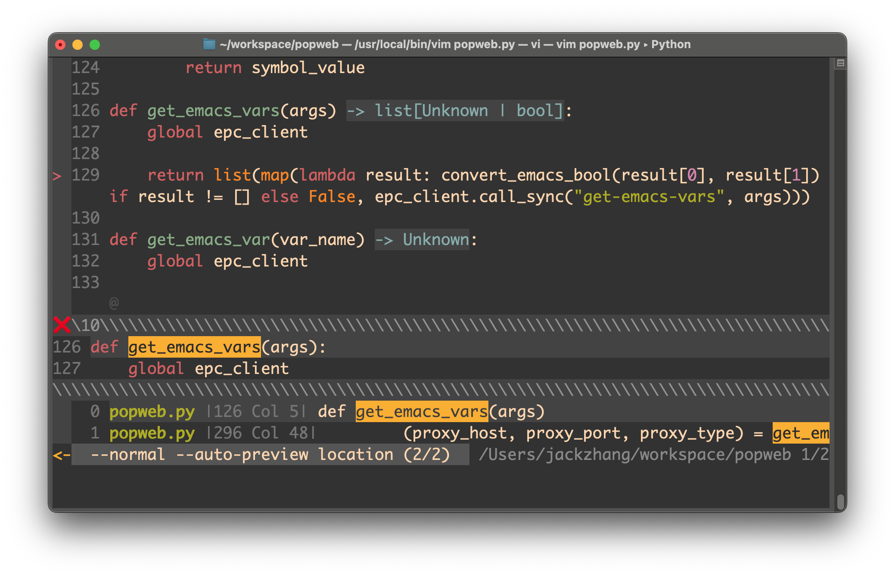

# ag.vim
show ag output with coclist, coc.nvim and coc-lists (coc plugin) are needed.

The g:agpkg is used by ag.vim to search for the word under cursor, g:agpkg should contains --column.

The ag can be silversearcher-ag (for linux), the_silver_searcher (for macos).

```
let g:agpkg = 'ag --nogroup --nocolor --column --ignore tags -w'
nnoremap <Leader>x : call ag#agsearch() <cr>
```


